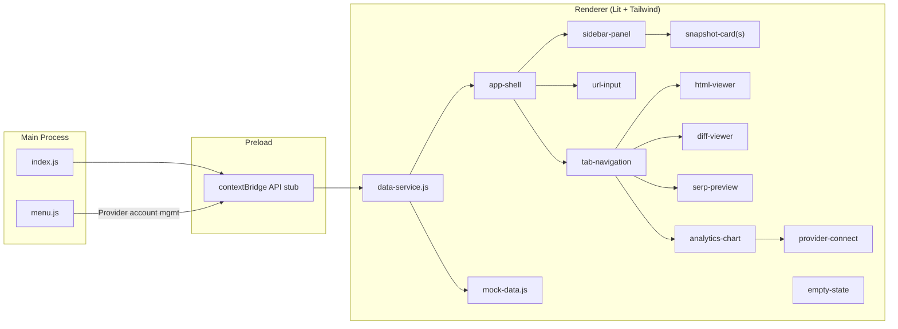

# Archive Accelerator -- Frontend Plan

## Scope: Frontend Only

This plan covers **only the UI layer**. No real backend logic is implemented:
- **No archive.org API calls.** The sync button triggers a mock that simulates progress with `setTimeout`, returning hardcoded fixture data.
- **No Google Search Console OAuth or API calls.** The connect button toggles a mock boolean. No browser auth windows, no token storage, no GSC API requests.
- **No database.** All data comes from `mock-data.js` -- static JS arrays/objects.
- **No IPC handlers in the main process.** The preload script exposes a `window.api` object with stub methods that call directly into `mock-data.js`. The stubs define the method signatures the backend will later implement.

Every data-touching function in `data-service.js` returns hardcoded mock data. The function signatures and return shapes are designed so that swapping mocks for real IPC calls later requires changes only in `data-service.js` -- zero component changes.

## Tech Stack

- **electron-vite** (v5) -- Vite-powered Electron tooling with HMR for renderer, hot-restart for main process. Run `npm run dev` and the app live-reloads on every save (no rebuild/relaunch needed for renderer changes).
- **Lit 3** -- Web Components in plain JS (no decorators, no TS). Components opt out of Shadow DOM via `createRenderRoot() { return this; }` so Tailwind utility classes work globally without `unsafeCSS` gymnastics.
- **Tailwind CSS v4** -- Installed via `@tailwindcss/vite` plugin. Dark-mode-only palette defined in a single CSS theme file.
- **ECharts v6** -- Full-featured charting for the Analytics time-series tab. Supports custom markLines/markPoints for change indicators on x-axis.
- **Electron 35+** -- macOS target. Native `Menu` API for app menus.

## Live Development Workflow

```
npm run dev          # starts electron-vite in watch mode
                     # renderer: Vite HMR (instant CSS/JS updates)
                     # main process: hot-restart on change
                     # preload: rebuild + renderer reload
```

No manual rebuild or app restart needed for UI work.

## Project Structure

```
archive-accelerator/
  package.json
  electron.vite.config.mjs
  src/
    main/
      index.js              # Electron main process, window creation
      menu.js               # Native macOS menu template
    preload/
      index.js              # contextBridge exposing IPC API
    renderer/
      index.html            # Entry HTML
      index.css             # Tailwind directives + dark theme tokens
      main.js               # Import all components, boot app
      services/
        data-service.js     # Facade: mock data now, real IPC later
        mock-data.js        # Hardcoded snapshot fixtures
      components/
        app-shell.js        # Top-level layout (sidebar + content)
        sidebar-panel.js    # Filter select + snapshot list + page info
        snapshot-card.js    # Single snapshot box (color, icons, date, %)
        url-input.js        # URL bar at top of content area
        tab-navigation.js   # Tab switcher (HTML / Diff / SERP / Analytics)
        html-viewer.js      # Tab 1: rendered HTML content
        diff-viewer.js      # Tab 2: plaintext diff with toggle
        serp-preview.js     # Tab 3: two Google SERP snippets
        analytics-chart.js  # Tab 4: time-series chart + change indicators (provider-agnostic)
        provider-connect.js # OAuth connect screen (shown when no data provider is linked)
        empty-state.js      # "No data yet" fallback screen
        sync-button.js      # Sync button + live download progress
```

## Native macOS Menus (`src/main/menu.js`)

Built via `Menu.buildFromTemplate()` + `Menu.setApplicationMenu()`:

- **Archive Accelerator** -- About, Check for Updates, Separator, Settings (preferences window or modal later), Separator, Quit
- **Edit** -- Undo, Redo, Cut, Copy, Paste, Select All (standard role-based items)
- **View** -- Reload, Toggle DevTools, Separator, Zoom In/Out, Reset Zoom
- **Accounts** -- Submenu per provider (initially just "Google Search Console"): Connect / Disconnect / Switch Property. Later expandable with Sistrix, Ahrefs, etc. For now, menu clicks send IPC events that toggle mock connection state in the renderer -- no real OAuth or API calls.
- **Window** -- Minimize, Zoom, Close
- **Help** -- Version info, Learn More (opens archive.org link)

## Data Service Layer (`data-service.js`)

A single facade module that the UI imports. Every method returns a Promise.

```js
// data-service.js -- swap implementation when backend lands
import * as mock from './mock-data.js';

export async function getSnapshots(url) { ... }
export async function getSnapshotContent(id) { ... }
export async function getPageInfo(url) { ... }
export async function syncUrl(url, onProgress) { ... } // mock: simulates progress via setTimeout, returns fixture data

// Analytics (provider-agnostic interface; GSC is the first provider)
export async function getAnalyticsData(url) { ... }    // mock: returns 16 months of fixture clicks/impressions/position
export function getConnectedProviders() { ... }        // mock: returns static provider list with togglable connected flag
export async function connectProvider(id) { ... }      // mock: toggles connected state, no real OAuth
export async function disconnectProvider(id) { ... }   // mock: toggles connected state, no real API call

// Preferences (persisted via electron-store or localStorage)
export function getChartPreferences() { ... }          // { clicks: true, impressions: true, position: false }
export function setChartPreferences(prefs) { ... }
```

When the backend arrives, this file switches from mock imports to `window.api.getSnapshots(url)` calls that go through the preload bridge to the main process IPC. No component code changes needed.

The **preload script** already exposes a `window.api` stub via `contextBridge.exposeInMainWorld` so the wiring is in place from day one.

## Component Details

### `app-shell`
Top-level grid layout: narrow fixed-width sidebar on the left, flexible content area on the right. Uses CSS Grid (`grid-cols-[280px_1fr]`).

### `sidebar-panel`
- **Page info bar** (top): document count, first/last snapshot dates, sync button.
- **Filter select**: `<select>` with options -- All, Template changed, Text changed, Headlines changed, Meta changed, Title changed.
- **Snapshot list**: scrollable `overflow-y-auto` container of `snapshot-card` elements.
- Filtering is done in-component by re-rendering the list from the full dataset with a filter predicate.

### `snapshot-card`
- Background: green base (`bg-emerald-*`) with opacity mapped to percentage value (higher % = more opaque).
- Content: date string, percentage number.
- Bottom row: 3 SVG icons (template, text, meta), each with a native `title` tooltip explaining what changed.
  - Default: gray outline stroke. Tooltip: "No change".
  - Changed (outline only): colored outline (e.g. amber for template, blue for text, purple for meta). Tooltips: "Template changed" / "Text changed" / "Meta description changed".
  - Changed (filled): solid fill for headline changes (text icon) or title-tag changes (meta icon). Tooltips: "Headlines changed" / "Title tag changed".
- Click emits a `snapshot-selected` custom event.
- Selected state: subtle ring/border highlight.

### `url-input`
Text input with a magnifying-glass or globe icon. On Enter/blur, dispatches `url-changed` custom event. The `app-shell` listens and calls `data-service.getSnapshots(url)`.

### `tab-navigation`
Four tabs: "HTML", "Diff", "SERP", "Analytics". Stores active tab index as reactive property. Renders the corresponding viewer component.

### `html-viewer`
Renders snapshot HTML in a sandboxed container (an `<iframe srcdoc="...">` with no styles, or a `<div>` with sanitized HTML). Displays instantly on snapshot selection.

### `diff-viewer`
- Toggle: "vs Previous" / "vs Live" (two-button segmented control).
- Displays a side-by-side or inline diff of plaintext. Uses a lightweight JS diff library (e.g. `diff` from npm) to compute and render additions/deletions with color coding (green for added, red for removed).

### `serp-preview`
- Two stacked Google SERP snippet cards.
- Each card mimics Google's result styling: blue title link (truncated at ~60 chars), green URL breadcrumb, gray description (~155 chars).
- Toggle: "vs Previous" / "vs Live" same as diff viewer.
- **Ordering rule**: the newer version is always on top. When comparing vs a newer snapshot (e.g. "vs Live"), the comparison version is on top and the selected version is on bottom. When comparing vs an older snapshot (e.g. "vs Previous"), the selected version is on top.

### `analytics-chart`
Provider-agnostic chart component. Receives time-series data and snapshot change data as properties -- it does not care where the data came from.
- **When a provider is connected and data is available**: renders an ECharts v6 time-series chart.
  - X-axis: dates spanning 16 months.
  - Y-axis: dual axis -- left for clicks/impressions, right (inverted) for position.
  - Three toggleable series: Clicks, Impressions, Position. Toggles are buttons above the chart. Last toggle configuration is persisted (via `data-service.getChartPreferences()` / `setChartPreferences()`).
  - **Change indicators on x-axis**: for every snapshot date where something changed, small icons are rendered along the bottom of the chart (on the x-axis line). These reuse the same 3-icon logic from `snapshot-card` (template / text / meta) with the same color and fill rules. Implemented via ECharts custom `markPoint` or a custom rendering layer on the x-axis.
- **When no provider is connected**: renders `provider-connect` component instead.

### `provider-connect`
Shows available data providers and their connection state. Initially only Google Search Console; designed to later list Sistrix, Ahrefs, etc.
- Each provider is a card with its logo/icon, name, and a "Connect" / "Connected" button.
- For GSC: styled "Connect with Google" button (matching Google OAuth button guidelines).
- On click: calls `data-service.connectProvider('gsc')` which toggles mock connected state (no real OAuth). In the future backend phase, this will open a system browser OAuth window via the main process.
- After mock "connection": a property selector dropdown appears (populated with mock properties). Once selected, the chart loads with fixture data.
- Adding a new provider later means adding another card to this component and a new provider handler in `data-service.js`.

### `empty-state`
Centered illustration/icon + "No data available for this URL" message + prompt to use the Sync button. Shown when URL has no snapshots in DB.

### `sync-button`
- Button with download icon. On click calls `data-service.syncUrl(url, onProgress)`.
- During sync: shows a progress indicator (e.g. "Downloading 12 / 47") that updates live via the `onProgress` callback. The mock simulates this with timed callbacks -- no real archive.org requests.
- When complete: triggers a re-fetch of snapshot list (still from mock data).

## Date Format

All dates throughout the entire app are displayed as `YYYY-MM-DD` (ISO 8601). This applies to snapshot cards, page info bar, chart x-axis, mock data, and any other date output.

## Styling Approach

- Single `index.css` with Tailwind v4 directives and a custom dark theme (CSS custom properties for surface, text, accent colors).
- All Lit components use light DOM (`createRenderRoot() { return this; }`), so Tailwind classes apply directly.
- Color palette: dark grays for surfaces (`#0f0f0f`, `#1a1a1a`, `#262626`), emerald/green accents for snapshots, blue/amber/purple for change-type icons.

## Communication Between Components

Lit components communicate via:
1. **Properties** (parent to child) -- e.g. `app-shell` passes `selectedSnapshot` to `html-viewer`.
2. **Custom Events** (child to parent) -- e.g. `snapshot-card` dispatches `snapshot-selected`, caught by `sidebar-panel` which re-dispatches or by `app-shell`.
3. **Shared reactive controller** (optional, if needed) -- a simple pub/sub store for cross-tree state like the currently loaded URL and active snapshot.

## Mock Data Shape

```js
// A snapshot object
{
  id: 'snap-001',
  url: 'https://example.com/page',
  date: '2024-03-15',
  percentage: 42,           // diff vs previous version
  templateChanged: true,
  textChanged: true,
  headlinesChanged: false,
  metaChanged: true,
  titleChanged: false,
  htmlContent: '<h1>Hello</h1><p>...</p>',
  plaintext: 'Hello ...',
  title: 'Example Page',
  metaDescription: 'This is an example page...',
}

// An analytics data point (one per day, provider-agnostic shape)
{
  date: '2024-03-15',
  clicks: 142,
  impressions: 3520,
  position: 8.4,
}

// Provider registry entry
{
  id: 'gsc',
  name: 'Google Search Console',
  connected: true,
  property: 'sc-domain:example.com',   // selected site/property
}
```

The mock dataset will contain ~15-20 snapshots for one URL and ~480 days (~16 months) of analytics data to demonstrate the full UI.

## Architecture Diagram



