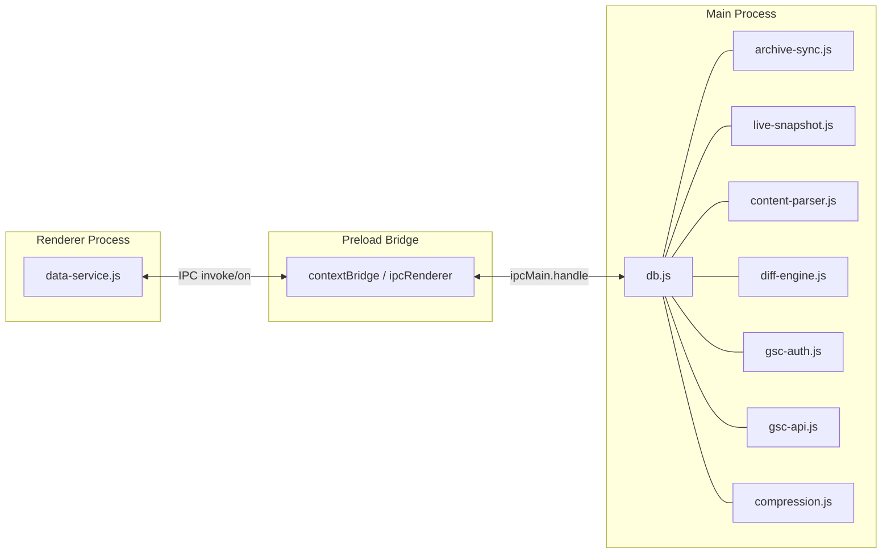

# Backend Implementation Plan

## Architecture Overview

All backend logic lives in the **main process** (`src/main/`). The renderer communicates exclusively through IPC via the preload bridge. Data is stored in a single **better-sqlite3** database file in the user's app data directory.



---

## 1. Dependencies and Build Config

**New npm dependencies:**

- `better-sqlite3` -- fast, synchronous SQLite for the main process
- `@electron/rebuild` -- recompile native modules against Electron's Node headers
- `rapidhash-js` -- fast hashing for content fingerprinting
- `dotenv` -- load `.env` credentials

**[package.json](package.json)** changes:

- Add `better-sqlite3`, `rapidhash-js`, `dotenv` to `dependencies`
- Add `@electron/rebuild` to `devDependencies`
- Add postinstall script: `"postinstall": "electron-rebuild -f -w better-sqlite3"`

**[electron.vite.config.mjs](electron.vite.config.mjs)** changes:

- Mark `better-sqlite3` as external in the main build so Vite does not try to bundle the native `.node` binary:

```javascript
main: {
    build: {
        rollupOptions: {
            external: ['better-sqlite3']
        }
    }
},
```

**New file: `.env.example`** (and `.env` added to `.gitignore`):

```
GSC_CLIENT_ID=
GSC_CLIENT_SECRET=
```

---

## 2. Database Layer -- `src/main/db.js`

Uses **better-sqlite3** with the DB file at `app.getPath('userData')/archive-accelerator.db`.

**Tables:**

- **`snapshots`** -- `id` INTEGER PK, `url` TEXT, `date` TEXT (YYYY-MM-DD), `source` TEXT ("wayback" or "live", extensible for future sources), `digest` TEXT, `html_compressed` BLOB (zstd), `plaintext` TEXT (lazily extracted), `title` TEXT, `meta_description` TEXT, `headlines_json` TEXT (JSON array of h1-h6 strings), `classes_ids_json` TEXT (JSON array)
- **`snapshot_diffs`** -- `snapshot_id` INTEGER FK, `prev_snapshot_id` INTEGER FK, `template_pct` REAL, `text_pct` REAL, `headlines_changed` INTEGER, `meta_pct` REAL, `title_changed` INTEGER, UNIQUE(snapshot_id, prev_snapshot_id)
- **`analytics_data`** -- `url` TEXT, `date` TEXT, `clicks` INTEGER, `impressions` INTEGER, `position` REAL, `provider` TEXT, UNIQUE(url, date, provider)
- **`providers`** -- `id` TEXT PK, `name` TEXT, `connected` INTEGER, `property` TEXT, `access_token` TEXT, `refresh_token` TEXT, `token_expiry` INTEGER
- **`settings`** -- `key` TEXT PK, `value` TEXT

Indexes on `snapshots(url, date, source)`, `analytics_data(url, date)`.

All writes use **transactions** for speed (especially bulk inserts during sync).

---

## 3. Compression -- `src/main/compression.js`

Uses **Node.js built-in zstd** (`node:zlib`). Electron 39 bundles Node 22.20.0 which has `zlib.zstdCompressSync` / `zlib.zstdDecompressSync`.

```javascript
import { zstdCompressSync, zstdDecompressSync, constants } from 'node:zlib';

export function compress(buffer) {
    return zstdCompressSync(buffer, {
        params: { [constants.ZSTD_c_compressionLevel]: 1 }
    });
}

export function decompress(buffer) {
    return zstdDecompressSync(buffer);
}
```

Zstd **level 1** is the sweet spot: roughly the same speed as lz4 but with a better compression ratio (~2.1x vs lz4's ~2.0x on HTML). Higher levels improve ratio but slow down significantly -- not worth it for our use case where processing speed matters most.

HTML is compressed before storing and decompressed on read. Plaintext, title, meta description, and extracted JSON fields are stored as plain TEXT (small, fast to query).

---

## 4. Archive.org Sync -- `src/main/archive-sync.js`

### Discovery via CDX API

Single request: `https://web.archive.org/cdx/search/cdx?url={url}&output=json&fl=timestamp,digest,statuscode&collapse=digest&filter=statuscode:200`

The `collapse=digest` parameter collapses consecutive captures with the same content hash into one row, returning **only the change points** -- exactly the snapshots where content actually changed. This avoids downloading unchanged versions entirely.

### Download Strategy

- Take the CDX result (list of `[timestamp, digest, statuscode]` rows)
- Filter out any timestamps already in DB for this URL (by matching `date` + `source = 'wayback'`)
- Download missing snapshots from `https://web.archive.org/web/{timestamp}id_/{url}`
- **Max 2 concurrent requests** using a semaphore/pool pattern
- **10 retries** with exponential backoff (1s, 2s, 4s, 8s... capped at 60s) on failure
- Send `progress` events to renderer via `mainWindow.webContents.send('sync-progress', { url, current, total, done })`

### Live Snapshot (parallel)

Concurrently with the archive.org download, fetch the live page via `fetch(url)` with a 30-second timeout. Store it as a snapshot with `source = 'live'` and `date` set to today.

### Post-Download Processing

After each HTML download, immediately:
1. Compress HTML with zstd and store `html_compressed`
2. Run content extraction (title, meta description, plaintext, headlines, classes/ids) -- see section 5
3. Compute diff against previous snapshot if exists -- see section 6
4. Hash extracted fields with rapidhash for fast future comparisons

---

## 5. Content Extraction -- `src/main/content-parser.js`

Pure string/regex-based parsing (no DOM library needed; these are full HTML docs).

First, split the HTML into head and body sections:

- **`getHead(html)`** -- extract everything before `<body` (i.e. the `<head>` content only)
- **`getBody(html)`** -- extract everything from `<body...>` to `</body>` (i.e. body content only)

Then extract from the correct section:

- **`extractTitle(html)`** -- regex for `<title>...</title>` on **head only** (prevents matching a `<title>` that might appear in body SVGs etc.)
- **`extractMetaDescription(html)`** -- regex for `<meta name="description" content="...">` on **head only**
- **`extractPlaintext(html)`** -- operates on **body only**; strip all tags (replace with space), handle `` alt text (` alt_text `), collapse whitespace, trim
- **`extractHeadlines(html)`** -- operates on **body only**; regex for `<h[1-6]>...</h[1-6]>`, return array of `{level, text}`
- **`extractClassesAndIds(html)`** -- regex for `class="..."` and `id="..."` attribute values, split class names, return sorted deduplicated array (operates on full HTML since classes/ids can be in head too, e.g. `<html class="...">`)

All extraction happens **at download time** so data is ready for instant display.

---

## 6. Diff Engine -- `src/main/diff-engine.js`

Uses the existing `diff` npm package (already a dependency).

- **`textDiffPercentage(a, b)`** -- uses `Diff.diffWords(a, b)`, counts changed characters vs total characters. Battle-tested word-level diffing.
- **`templateDiffPercentage(classesIdsA, classesIdsB)`** -- treats both as sorted arrays of strings, computes symmetric difference / union ratio. Only compares class names and id values.
- **`headlinesChanged(headlinesA, headlinesB)`** -- boolean, compares JSON-serialized headline arrays
- **`metaDiffPercentage(titleA, descA, titleB, descB)`** -- `(textDiffPct(titleA, titleB) * 0.5) + (textDiffPct(descA, descB) * 0.5)`
- **`titleChanged(titleA, titleB)`** -- boolean
- **`computeDisplayPercentage(diff, filter)`**:
  - `"all"` -> `avg(template_pct, text_pct, meta_pct)`
  - `"template"` -> `template_pct`
  - `"text"` -> `text_pct`
  - `"headlines"` -> text_pct (same diff, filtered to only show when headlines changed)
  - `"meta"` -> `meta_pct`
  - `"title"` -> title-only diff percentage

Diffs are computed at download time and stored in `snapshot_diffs` for instant UI display.

---

## 7. GSC OAuth2 -- `src/main/gsc-auth.js`

Credentials loaded from `.env` via `dotenv`.

### OAuth Flow

1. Open system browser (`shell.openExternal`) to Google's consent URL with:
   - `client_id` from `.env`
   - `redirect_uri = http://127.0.0.1:{PORT}/callback`
   - `scope = https://www.googleapis.com/auth/webmasters.readonly`
   - `response_type = code`
   - `access_type = offline` (to get refresh token)
2. Start a temporary local HTTP server on a random port
3. Catch the callback, extract the `code` parameter
4. Exchange code for `access_token` + `refresh_token` via Google's token endpoint
5. Fetch available properties via `https://www.googleapis.com/webmasters/v3/sites`
6. Store tokens and selected property in the `providers` table
7. Shut down the local server

Token refresh happens automatically when `access_token` expires (check `token_expiry` before each API call).

---

## 8. GSC Data Fetch -- `src/main/gsc-api.js`

- **`fetchAnalytics(url, accessToken, property)`** -- POST to `https://searchconsole.googleapis.com/webmasters/v3/sites/{property}/searchAnalytics/query`
- Request body: `{ startDate: "earliest possible", endDate: "today", dimensions: ["date"], dimensionFilterGroups: [{ filters: [{ dimension: "page", expression: url }] }], rowLimit: 25000 }`
- The API maximum range is ~16 months. To get the full available range, start with a very early date (e.g. 18 months ago) -- the API returns data only for available dates.
- Store rows in `analytics_data` table
- Return data to renderer for charting

---

## 9. IPC Handlers -- update `src/main/index.js`

Register all handlers on `ipcMain`:

| Channel | Direction | Purpose |
|---|---|---|
| `get-snapshots` | invoke | Return snapshots for a URL from DB |
| `get-snapshot-content` | invoke | Return decompressed HTML for a snapshot |
| `get-page-info` | invoke | Return doc count, first/last dates |
| `sync-url` | invoke | Start archive.org sync + live snapshot |
| `sync-progress` | send | Progress updates during sync |
| `get-analytics-data` | invoke | Return analytics rows from DB |
| `get-providers` | invoke | Return connected providers |
| `connect-provider` | invoke | Start OAuth flow |
| `disconnect-provider` | invoke | Clear tokens |
| `get-chart-preferences` | invoke | Read from settings table |
| `set-chart-preferences` | invoke | Write to settings table |

---

## 10. Preload Bridge -- update `src/preload/index.js`

Expose all IPC channels above through `contextBridge.exposeInMainWorld('api', { ... })`. Add an `onSyncProgress` listener.

---

## 11. Renderer Data Service -- update `src/renderer/services/data-service.js`

Replace all mock imports with `window.api.*` IPC calls. The function signatures stay the same so no component changes are needed. `mock-data.js` can be kept for reference but will no longer be imported.

---

## 12. Menu Updates -- update `src/main/menu.js`

Wire the "Connect..." menu item to trigger the real OAuth flow via IPC. "Disconnect" clears tokens in DB. "Switch Property..." sends the list of available properties to the renderer for selection.

---

## File Summary

| File | Action |
|---|---|
| [package.json](package.json) | Add deps, postinstall script |
| [electron.vite.config.mjs](electron.vite.config.mjs) | Externalize better-sqlite3 |
| `.env.example` | New -- GSC credential template |
| `.gitignore` | Add `.env` |
| `src/main/db.js` | **New** -- SQLite setup, migrations, CRUD |
| `src/main/compression.js` | **New** -- zstd compress/decompress |
| `src/main/archive-sync.js` | **New** -- CDX discovery + download pool |
| `src/main/live-snapshot.js` | **New** -- fetch live page HTML |
| `src/main/content-parser.js` | **New** -- extract title, meta, text, headlines, classes/ids |
| `src/main/diff-engine.js` | **New** -- compute all diff types and percentages |
| `src/main/gsc-auth.js` | **New** -- OAuth2 flow |
| `src/main/gsc-api.js` | **New** -- GSC searchAnalytics queries |
| [src/main/index.js](src/main/index.js) | Add IPC handlers, init DB |
| [src/main/menu.js](src/main/menu.js) | Wire real GSC actions |
| [src/preload/index.js](src/preload/index.js) | Expose all IPC channels |
| [src/renderer/services/data-service.js](src/renderer/services/data-service.js) | Replace mock with IPC calls |
